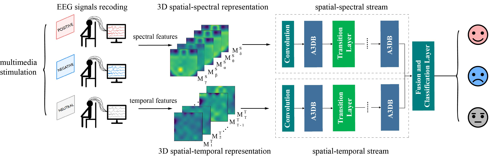
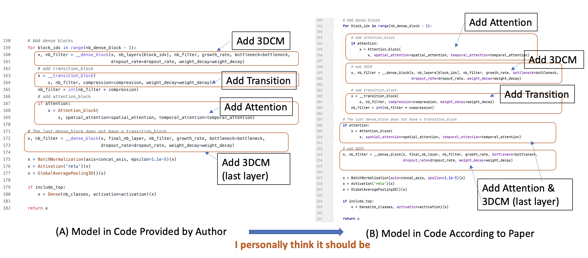
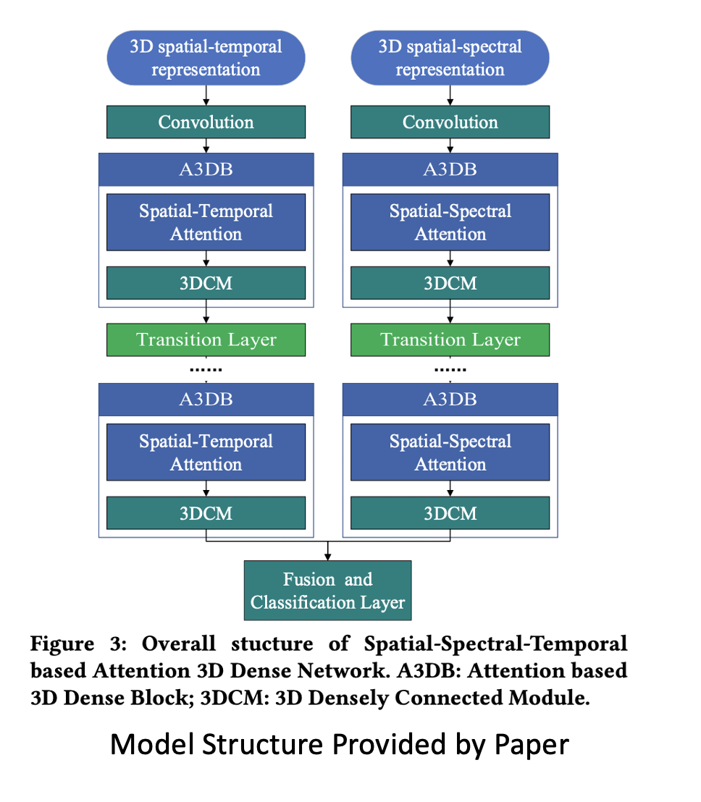

# SST-EmotionNet -- Reproduced by Pytorch

SST-EmotionNet: Spatial-Spectral-Temporal based Attention 3D Dense Network for EEG Emotion Recognition

The SST-EmotionNet consists of the spatial-spectral stream and spatial-temporal stream. Each stream is made up of several Attention based 3D Dense Blocks (A3DB) and Transition Layers.



# Introduction of My Reproducing

 When I rewrite SST-Net by pytorch, I find the neural network structure implemented in code provided by authors is inconsistent with this paper.

So I reproduced it by pytorch following the framework of this paper. The following is my personal understanding.

- Specifically, the order of SST network mentioned in this paper should be: Convolution layer > Attention > 3D Dense layer > Transition layer > Attention > 3D Dense layer > Transition layer > Attention > 3D Dense layer.
- However, the order in their GitHub code is: Convolution layer > 3D Dense layer > Transition layer > Attention > 3D Dense layer > Transition layer > Attention > 3D Dense layer.





# Dataset

SEED and SEED-IV datasets, which are available at: http://bcmi.sjtu.edu.cn/~seed/downloads.html. The SEED dataset contains subjects' EEG signals when they were watching films clips. The film clips are carefully selected so as to induce different types of emotion, which are positive, negative, and neutral ones. The SEED-IV is an evolution of the original SEED dataset. The category number of emotion change to four: happy, sad, fear, and neutral. The extracted differential entropy (DE) features of the EEG signals in these datasets are used.

# Requirements

- Python 3.7.7
- CUDA 10.1
- CuDNN 7.6.5

- numpy==1.16.2

- scipy==1.4.1

- torch==1.10.0


# Usage

- Data Preprocessing
  
  Run `Preprocess.py` , which refers to the path of the configuration file for training. For instance, the model is trained by:

  ```
    python Preprocess.py
  ```

- Configuration

  We provide a sample configuration file `SEED.ini` for SEED dataset. 

  - `input_width` denotes the width of 2D map.
  - `specInput_length` and `temInput_length` denote how many 2D maps are stacked in the 3D spatial-spectral representation and 3D spatial-temporal representation, respectively.
  -  `depth_spec` and `depth_tem` denote the number of layers in spatial-spectral stream and spatial-temporal stream.
  -  `nb_dense_block` denotes the number of A3DBs to add to end. 
  - `gr_spec ` and `gr_tem ` denote the growth rate of spatial-spectral stream and spatial-temporal stream. 

- Training

  Run `run.py` , which refers to the path of the configuration file for training. For instance, the model is trained by:

  ```
    python run.py
  ```

# References

```latex
@inproceedings{jia2020sst,
  title={SST-EmotionNet: Spatial-spectral-temporal based attention 3D dense network for EEG emotion recognition},
  author={Jia, Ziyu and Lin, Youfang and Cai, Xiyang and Chen, Haobin and Gou, Haijun and Wang, Jing},
  booktitle={Proceedings of the 28th ACM International Conference on Multimedia},
  pages={2909--2917},
  year={2020}
}
```


